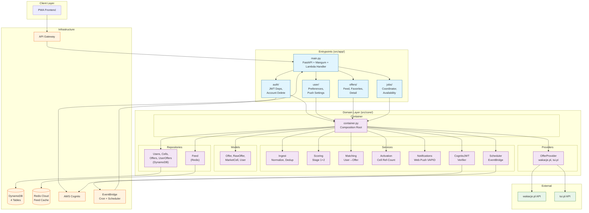

# TraveLis Backend — Architecture

> Auto-generated from GitNexus knowledge graph (1866 symbols, 3525 relationships, 108 execution flows).

## Overview

TraveLis is a vacation deal aggregator. Users set trip preferences; the backend scrapes offers from [wakacje.pl](https://wakacje.pl) and [tui.pl](https://tui.pl), scores them via a two-stage attractiveness algorithm, and serves a personalized, paginated feed. Revenue comes from [travellead.pl](https://travellead.pl) referral links appended to every offer URL.

**Runtime model**: Two AWS Lambda functions sharing one artifact ("lambdalith") — a short-timeout API function and a 15-minute cron function. FastAPI runs via [Mangum](https://mangum.io/). Async end-to-end with `aioboto3`, `httpx.AsyncClient`, and `redis.asyncio`.

**Layering**: Hexagonal — `src/core/` (domain + adapters) never imports `src/app/` (entrypoints).

---

## Functional Areas

The codebase decomposes into 12 functional areas, auto-detected by GitNexus community detection:

| Area             | Symbols | Description                                                                          |
| ---------------- | ------- | ------------------------------------------------------------------------------------ |
| **App**          | 12      | Entrypoints: FastAPI app, Lambda handler, auth, rate limiter, FastAPI dependencies   |
| **Jobs**         | 7       | Background job orchestrators: scrape coordinator, availability checker               |
| **Auth**         | 5       | JWT verification dependencies, account deletion controller                           |
| **User**         | 7       | User preferences controller, push notification settings                              |
| **Offers**       | 5       | Paginated offer feed controller, API schemas                                         |
| **Providers**    | 17      | Provider ports and adapters: base protocol, TUI, wakacje.pl                          |
| **Models**       | 4       | Domain models: Offer, RawOffer, MarketCell, User, common types                       |
| **Repositories** | 16      | DynamoDB adapters (users, cells, offers, user_offers) + Redis feed repo              |
| **Services**     | 12      | Business logic: ingest, matching, scoring, activation, scheduler, notifications, JWT |
| **Scoring**      | 2       | Attractiveness scoring algorithm (two-stage: price gate + composite)                 |
| **Exceptions**   | 11      | Core and app exception hierarchies                                                   |
| **Scripts**      | 9       | One-off contract probes and utilities (not part of the app)                          |

---

## Key Execution Flows

### 1. Scrape Pipeline (most complex: 8 steps, 5 community hops)

```
handler()                            # src/app/main.py:209 — dual-entry Lambda handler
  └─ handle_non_http()               # src/app/main.py:137 — EventBridge dispatch
       └─ run_scrape_job()           # src/app/jobs/coordinator.py:45 — coordinator
            └─ worker()              # src/app/jobs/coordinator.py:78 — asyncio worker pool
                 └─ ingest_raw_offers()  # src/core/services/ingest.py — normalize & persist
                      └─ compute_offer_id()  # SHA-256 semantic fingerprint
                           └─ normalize_hotel()  # Hotel name normalization
                                └─ normalize_text()  # Lowercase + transliterate
```

Fetches all active market cells (DynamoDB Scan), fans out HTTP requests to provider APIs via an `asyncio` worker pool (~10 concurrent workers), scores offers, and writes attractive offers to the `Offers` table.

### 2. Offer Feed API

```
GET /v2/offers?sort=attractiveness&order=desc&limit=20
  └─ get_offers_feed()              # src/app/offers/controller.py:62
       ├─ get_current_user()        # src/app/auth/dependencies.py — JWT validation
       ├─ get_container()           # src/app/dependencies.py — DI composition root
       ├─ container.initialize()    # src/core/container.py:48 — cold start init
       ├─ feed_repo.get_or_build_sort_zset()  # Lazy Redis ZSET build
       ├─ offers_repo.get_batch()   # DynamoDB batch get for hydration
       ├─ _prune_stale_user_offers()  # Clean orphaned UserOffers rows
       └─ feed_repo.get_page()      # Redis ZRANGE pagination
```

### 3. User Preferences Update

```
PUT /v2/user/preferences
  └─ update_preferences()           # src/app/user/controller.py:64
       ├─ get_current_user()        # JWT validation
       ├─ get_container()           # DI
       ├─ container.initialize()
       ├─ activation_service.update_cells()  # Compute new cell set, ref-count
       ├─ scheduler_service.schedule_match()  # EventBridge Scheduler (debounced at(now+15s))
       └─ users_repo.put()          # Save preferences to DynamoDB
```

### 4. Account Deletion (Cascade)

```
DELETE /v2/auth/account
  └─ delete_account()               # src/app/auth/controller.py:31
       ├─ get_current_user()
       ├─ get_container()
       ├─ container.initialize()
       ├─ cognito_client.admin_delete_user()  # Cognito user removal
       ├─ users_repo.delete()       # DynamoDB Users row
       ├─ user_offers_repo.delete_all()  # All UserOffers for this user
       ├─ feed_repo.delete_all()    # All Redis keys for this user
       └─ scheduler_service.delete_all()  # Pending Scheduler schedules
```

### 5. Availability Check (wakacje.pl, intra-provider)

```
run_availability_job()
  └─ WakacjePlProvider.check_availability()     # src/core/providers/wakacjepl/main.py
       └─ _resolve_live_variant()               # POST getCalculatorOfferVariants
            └─ _fetch_calculator_variants()     # HTTP fetch with stored metadata
                 └─ _raise_api_response_exception()
                      └─ _status_code_from_error()
```

### 6. Bulk User Matching (post-scrape or debounced)

```
MatchingService.bulk_match_users()    # src/core/services/matching.py:248
  └─ match_user_offers()              # src/core/services/matching.py
       └─ ActivationService.generate_required_cells()  # src/core/services/activation.py:59
            └─ resolve_months_for_range()  # Expand month range to YYYY-MM strings
```

---

## Architecture Diagram



---

## Data Flow Summary

```
                          ┌─────────────────────────────┐
                          │      EventBridge (Cron)      │
                          │  scrape_offers (3x daily)    │
                          │  check_availability (1x)     │
                          └──────────┬──────────────────┘
                                     │
                          ┌──────────▼──────────────────┐
                          │   handle_non_http()          │
                          │   src/app/main.py           │
                          └──────────┬──────────────────┘
                                     │
              ┌──────────────────────┼──────────────────────┐
              │                      │                      │
   ┌──────────▼──────────┐ ┌────────▼────────┐  ┌─────────▼─────────┐
   │ run_scrape_job()    │ │ match_user_offers│  │run_availability_job│
   │ coordinator.py      │ │ matching.py      │  │ availability.py    │
   └──────────┬──────────┘ └────────┬────────┘  └─────────┬─────────┘
              │                     │                      │
              ▼                     ▼                      ▼
   ┌─────────────────────────────────────────────────────────┐
   │                Core Services Layer                       │
   │  ┌─────────┐  ┌────────┐  ┌──────────┐  ┌───────────┐  │
   │  │ Ingest  │  │Scoring │  │ Matching │  │Activation │  │
   │  └────┬────┘  └───┬────┘  └────┬─────┘  └─────┬─────┘  │
   └───────┼───────────┼────────────┼───────────────┼────────┘
           │           │            │               │
           ▼           ▼            ▼               ▼
   ┌──────────────────────────────────────────────────────────┐
   │                    Data Stores                           │
   │  ┌──────────────┐  ┌──────────────┐  ┌───────────────┐  │
   │  │ DynamoDB     │  │ DynamoDB     │  │ Redis Cloud   │  │
   │  │ Offers       │  │ MarketCells  │  │ Feed: ZSETs   │  │
   │  │ Users        │  │ UserOffers   │  │ Versions      │  │
   │  └──────────────┘  └──────────────┘  └───────────────┘  │
   └──────────────────────────────────────────────────────────┘
                              ▲
                              │
                   ┌──────────┴──────────┐
                   │   FastAPI Routes    │
                   │  /v2/offers     │
                   │  /v2/user       │
                   │  /v2/auth       │
                   │  /v2/health     │
                   └─────────────────────┘
                              ▲
                              │
                         ┌────┴────┐
                         │API GW  │
                         └────────┘
```

---

## Key Architecture Decisions

| Decision             | Choice                                                                            |
| -------------------- | --------------------------------------------------------------------------------- |
| Deployment           | Lambdalith — single artifact, two Lambda functions                                |
| Layering             | Hexagonal: `core` never imports `app`                                             |
| Async                | Async end-to-end (`aioboto3`, `httpx`, `redis.asyncio`)                           |
| Scraping             | `asyncio` worker pool fan-out within a single invocation                          |
| Offer Identity       | SHA-256 semantic fingerprint (not provider IDs)                                   |
| Dedup                | Intra-scrape (lowest price) + cross-provider (fingerprint collision)              |
| Persistence          | DynamoDB (4 tables, no GSIs) + Redis Cloud (feed cache)                           |
| Scoring              | Two-stage: Z-score price gate → composite (price 40%, rating 40%, reviews 20%)    |
| Feed                 | Lazy Redis ZSET per (user, sort, order, version) built on first request           |
| Matching             | Event-driven: post-scrape auto-match + debounced preference updates via Scheduler |
| Account Provisioning | Cognito PostConfirmation trigger creates Users + default cells                    |

See [docs/architecture/](docs/architecture/) for detailed docs on each subsystem.
