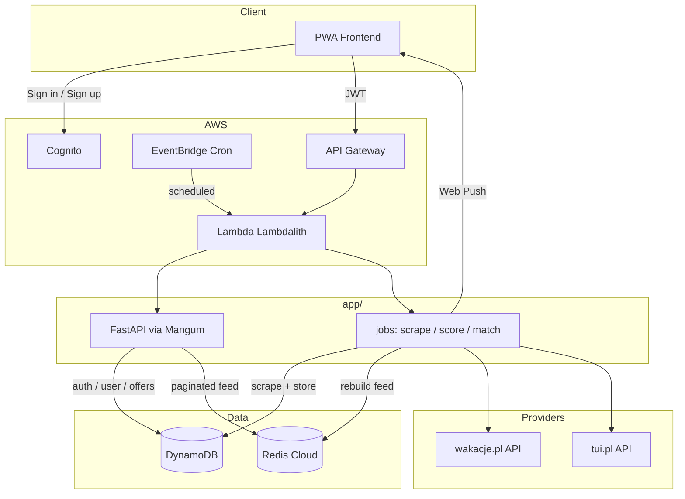

# TraveLis Backend

**TraveLis** is a PWA backend that finds bargain package holidays (flight + hotel) from [wakacje.pl](https://wakacje.pl) and [tui.pl](https://tui.pl). Users set trip preferences and get notified when new matching deals appear.

## Architecture

