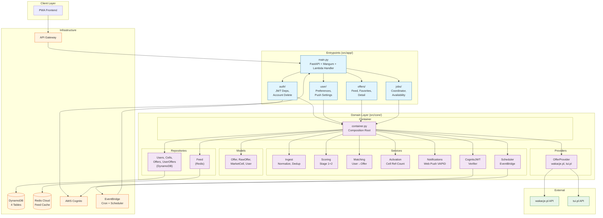

# TraveLis Backend

**TraveLis** is a vacation deal aggregator. It scrapes package holidays (flight + hotel) from [wakacje.pl](https://wakacje.pl) and [tui.pl](https://tui.pl), scores them by attractiveness, and serves a personalized feed to users via a PWA frontend. Revenue comes from [travellead.pl](https://travellead.pl) referral links appended to every offer URL.

## Problem

Finding a good last-minute deal across multiple tour operators is tedious and slow. TraveLis automates the search — users set trip preferences once, and get notified when attractive new offers match their criteria. No manual tab-switching or price comparison needed.

## Technologies

| Layer | Stack |
|-------|-------|
| Runtime | Python 3.12+, FastAPI, Mangum (Lambda adapter) |
| Async | `aioboto3`, `httpx.AsyncClient`, `redis.asyncio` |
| Data | DynamoDB (4 tables, no GSIs), Redis Cloud (feed ZSETs) |
| Auth | AWS Cognito + JWT verification |
| Infra | AWS Lambda (lambdalith), API Gateway HTTP v2, EventBridge, Terraform |
| Scraping | `asyncio` worker pool, per-provider adapters |

## Deployment

Two AWS Lambda functions sharing a single artifact ("lambdalith"):
- **API Lambda** — 30s timeout, serves FastAPI routes via Mangum behind API Gateway
- **Cron Lambda** — 15min timeout, runs scrape jobs (3x daily), availability checks (1x daily), and debounced user matching

Provisioned with Terraform under `infra/environments/dev/`. Cognito PostConfirmation triggers auto-provision new users.

## Architecture

See [ARCHITECTURE.md](ARCHITECTURE.md) for execution flows, data flow diagrams, and key architecture decisions.
