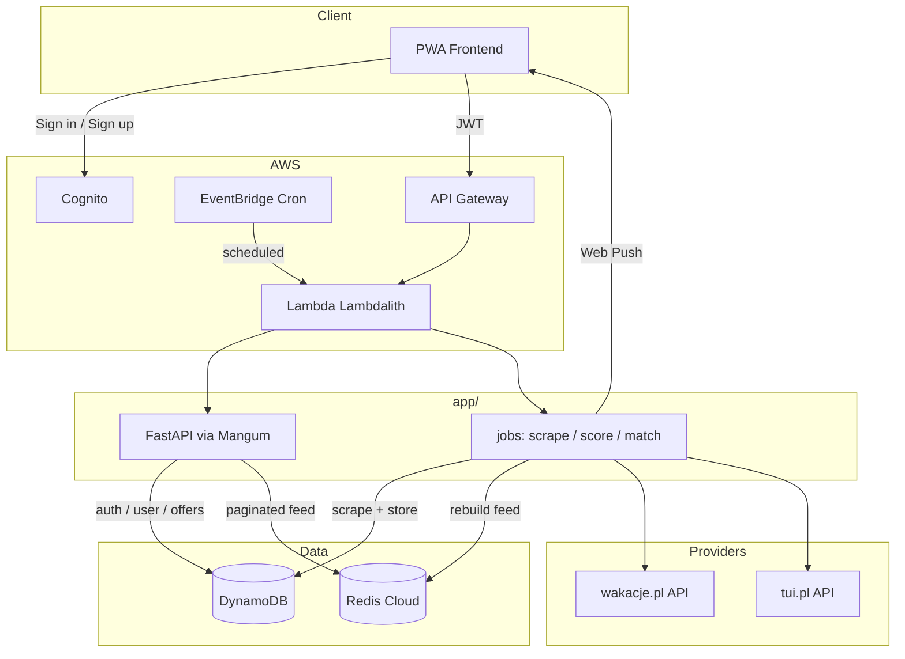

# TraveLis Backend

**TraveLis** is a PWA backend that finds bargain package holidays (flight + hotel) from [wakacje.pl](https://wakacje.pl) and [tui.pl](https://tui.pl). Users set trip preferences and get notified when new matching deals appear.

## Architecture



## Documentation

Start with **agent-guidelines.md**, then follow the suggested reading order below. Each document is self-contained.

| # | Document | Description |
|---|----------|-------------|
| 1 | [agent-guidelines.md](docs/architecture/agent-guidelines.md) | **Mandatory rules for AI agents and engineers** — read first |
| 2 | [architecture.md](docs/architecture.md) | Architecture entry point: documentation map, key decisions, schedules |
| 3 | [requirements.md](docs/architecture/requirements.md) | Product requirements, user preferences, supported countries/airports |
| 4 | [system-overview.md](docs/architecture/system-overview.md) | Lambdalith layout, modules, dual-entry handler, runtime model |
| 5 | [code-structure.md](docs/architecture/code-structure.md) | Hexagonal layering, models, repositories, container, import conventions |
| 6 | [data-model.md](docs/architecture/data-model.md) | DynamoDB tables, Redis keys, offer identity & fingerprinting |
| 7 | [pipeline.md](docs/architecture/pipeline.md) | Scraping, scoring, matching, debouncing, schedules |
| 8 | [attractiveness.md](docs/architecture/attractiveness.md) | Two-stage statistical scoring algorithm |
| 9 | [api.md](docs/architecture/api.md) | REST API (`/api/v2/*`) contracts, request/response schemas |
| 10 | [infrastructure.md](docs/architecture/infrastructure.md) | Terraform modules, AWS resources, Redis Cloud, env vars |
| — | [providers/index.md](docs/providers/index.md) | External API contracts (wakacje.pl + tui.pl, reverse-engineered) |

## Tech stack

- AWS Lambda + Mangum + FastAPI
- DynamoDB + Redis Cloud
- AWS Cognito
- Terraform

## Local development

```bash
uvicorn app.main:app --reload --port 8000 --app-dir src
```

## Project layout

```
src/
├── core/                  # Domain layer
│   ├── models/            # Cell, Offer, RawOffer, Preferences, UserOffer
│   ├── providers/         # Provider port (Protocol), adapters (wakacje, tui), registry
│   ├── repositories/      # Repository ports + aioboto3/redis adapters
│   ├── services/          # ingest, scoring, matching, activation, notifications
│   ├── config.py          # pydantic-settings Settings
│   └── container.py       # Composition root (clients, repos, providers)
└── app/                   # Entrypoints only
    ├── main.py            # FastAPI app + dual-entry Lambda handler
    ├── auth/              # Delete account (Cognito cascade); sign-in/sign-up are Cognito-direct (not backend endpoints)
    ├── user/              # Preferences, push subscription settings
    ├── offers/            # Paginated offer feed
    └── jobs/              # coordinator, match_users, availability (orchestration only)
```

See [docs/architecture/code-structure.md](docs/architecture/code-structure.md) for the full layering, dependency rules, and module responsibilities.
