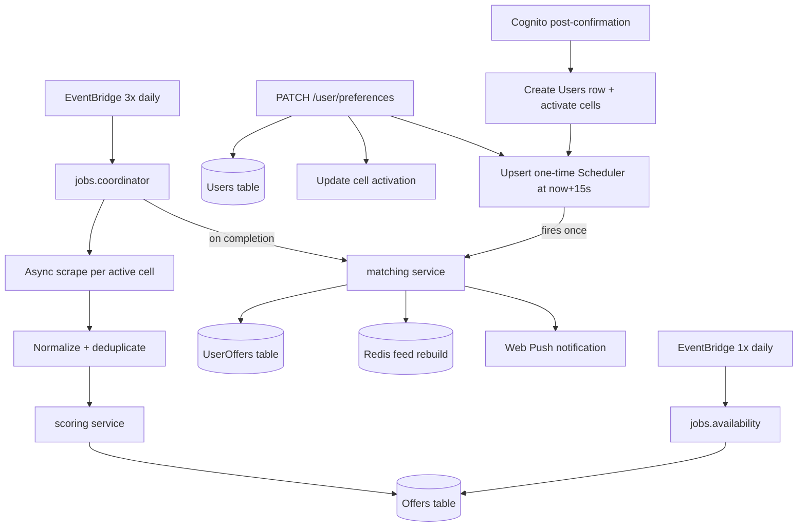

# Data Pipeline

End-to-end flow from scraping to user feed.

## Pipeline stages



Matching is **event-driven** — there is no constant poll. Two independent triggers run the user matching logic (see [Trigger sources](#trigger-sources)).

## Market cells

### Definition

A global market cell is identified by:

```
(country, month, min_stars, board, adults, children)
```

- `country` — ISO 3166-1 alpha-2
- `month` — `YYYY-MM` (derived from user date range)
  - **Travel Month Expansion**: If a user's date range spans multiple months, they activate cells for all months overlapping that range. If the user's travel dates are not configured ("Any"), they activate cells for the current month and the next 5 months (6 months total).
- `min_stars`, `board`, `adults`, `children` — from user preferences

This same tuple is used for **scraping**, **statistical comparison**, and **scoring**.

### Activation and Decoupling Model

Cells are global — not per-user. When any user's preferences require a cell, `activation_count` increments. Scraping runs once per active cell regardless of how many users share it.

To keep cell scraping decoupled from user-specific details (and avoid expensive queries to find active users during scraping):

1. **Departure Airports**: Scraper requests are always sent with "Any" departure airport. User-specific departure airport preferences are applied as filters on the backend during the user matching phase.
2. **Duration / Stay Length**: Scraper requests query a wide default range of `2-28` nights. Exact min/max duration filters are applied during the user matching phase.
3. **Representative Child Age**: Providers require birth dates to calculate prices. Because global cells only track the _number_ of children, cells with `children > 0` are scraped using a representative child age of **8 years old** (birth date calculated as January 1st of `current_year - 8`). Exact matching filters on child ages are applied in Python during matching.

### Coordinator (`jobs.coordinator`)

Triggered 3× daily by EventBridge.

1. Scan the `MarketCells` table (all rows are active by definition — a cell exists only when `activation_count > 0`).
2. Schedule one async scrape task per cell with bounded concurrency (using an `asyncio` worker pool of ~10 workers).
3. Each task calls wakacje.pl and tui.pl APIs (see [providers/](../providers/index.md)).
4. Pass raw results to normalization → scoring → `Offers` table.

The worker pool fan-out lives in the orchestrator; per-cell work calls `async` `core` functions, and CPU-bound scoring is offloaded via `asyncio.to_thread`. See [system-overview.md](system-overview.md#concurrency-model-for-jobs).

## Scrape → normalize

1. Map provider fields to canonical offer schema.
2. Compute semantic fingerprint → `offer_id`.
3. **Collapsing/Deduplication**: Collapse provider search results with the same semantic fingerprint (intra-scrape and cross-provider), keeping the lowest price variant and accumulating sources (see [data-model.md](data-model.md#deduplication-and-variant-collapsing)).
4. **Provider metadata:** persist `metadata.wakacje_pl` or `metadata.tui` (see [data-model.md](data-model.md#offer-metadata)) — required for later per-offer availability checks without re-scraping the offer page.
5. Attach `cell_id` from the scrape context.
6. Forward to scoring.

## Scoring (scoring service)

See [attractiveness.md](attractiveness.md).

Only offers passing stage 2 are written to `Offers`. If an offer already exists in DynamoDB for the same `(cell_id, offer_id)`, the ingestion process retrieves the existing item, merges the new and old variant sources, updates the primary offer details with the lowest-priced variant, and saves it back (preventing overwrite of other provider data).

## User matching (matching service)

### Trigger sources

There is **no 2-minute sweeper**. Two distinct events drive matching:

| Trigger           | Cause               | Mechanism                                                                        |
| ----------------- | ------------------- | -------------------------------------------------------------------------------- |
| Per-user re-match | preferences changed | EventBridge Scheduler one-time schedule `at(now + 15s)`, debounced by overwrite  |
| Bulk re-match     | new offers scraped  | `jobs.coordinator`, on completion, matches users of the affected (updated) cells |

### Preference debouncing (EventBridge Scheduler)

On `PATCH /api/v2/user/preferences`:

1. Save latest preferences to `Users`.
2. Update market cell activation (increment/decrement).
3. **Upsert** a one-time schedule named `match-{user_id}` with `ScheduleExpression = at(now + 15s)` and `ActionAfterCompletion: DELETE`.

**Coalescing:** the schedule name is deterministic (`match-{user_id}`), so each edit simply overwrites the fire time — repeated edits collapse into **one** match run 15s after the last edit. No polling, no `refresh_after` field, no GSI.

**Target:** the schedule invokes the lambdalith with payload `{ "type": "match_user", "user_id": "..." }` (handled by the dual-entry handler).

**Race handling:** if a PATCH lands while a match is mid-run, the run used near-current preferences and the new PATCH has already scheduled another run in 15s — eventual consistency without an explicit compare-and-swap.

### Match logic

For each claimed user:

1. Load preferences.
2. **Self-healing month shift** (open-ended dates only): when `date_from` and `date_to` are both unset, matching compares the reference date to the month stored in `user.updated_at`. If the calendar month changed, re-run cell activation for the rolling 6-month window anchored to the new reference date, then persist `updated_at` with the new month. This keeps active cells aligned with "Any" travel dates without a sweeper cron. Users who never match still rely on the next preference PATCH or bulk post-scrape match to refresh cells.
3. Resolve required `cell_id` set.
4. Query `Offers` for those cells.
5. Filter in Python using the user's exact preferences:
   - Match departure airports (if list is not empty `[]`).
   - Match exact stay duration bounds (`duration_min` to `duration_max`).
   - Match travel date range (`date_from` to `date_to`).
   - Match minimum TripAdvisor rating (`min_rating`).
   - Match children exact ages/birthdays (re-checking suitability if children are present).
6. **Sync `UserOffers` rows**:
   - Query existing `UserOffers` keys for the user.
   - Diff the new matches against the old matches.
   - Batch-delete obsolete matches and batch-write new matches (limits DynamoDB write churn).
7. Rebuild Redis feed (increment `feed_version`, invalidating cached ZSETs).
8. If push enabled and feed changed → send generic _"New deals available"_ notification (in Polish language). If the push endpoint returns HTTP 404/410 (expired subscription), disable push on the user record.

## Availability check (`jobs.availability`)

Triggered 1× daily.

Baseline is **availability-by-absence**, which works for both providers without a per-offer endpoint: an offer no longer returned by the latest scrape of its cell is marked `available = false`, and the `departure_date` TTL eventually removes it.

Optional refinement for fresher availability _between_ scrapes (requires provider metadata persisted at ingest — see [data-model.md](data-model.md#offer-metadata)):

- **tui.pl:** `GET /api/www/hotel-cards/offers?offerCode={metadata.tui.offer_code}` (returns `OK` / `UNAVAILABLE`).
- **wakacje.pl:** two-step JSON API using stored `metadata.wakacje_pl` + canonical offer fields (no offer-page HTML fetch):
  1. `POST /v2/api/getCalculatorOfferVariants/{external_offer_id}` — empty `offers` ⇒ unavailable for this configuration.
  2. `GET /v2/api/checkOfferAvailability` — `data.availability` + `data.status === "OK"`.

Contract details: [providers/wakacjepl/contract.md](../providers/wakacjepl/contract.md#offer-availability). Prototype: `notebooks/wakacje_pl_availability.ipynb`.

If the check determines that the offer is no longer available, the offer is deleted from the `Offers` table. If one or more offers are deleted, the availability job collects their `cell_id`s and triggers a bulk user re-matching run (`MatchingService.bulk_match_users`) at the end of the job to immediately prune the deleted offers from `UserOffers`. Otherwise, if the offer is still available but its price has changed, its price attributes (`price_total` and `price_per_day`) are updated in-place.

## Redis feed rebuild and lazy ZSET pagination

### Lazy ZSET Building

The ZSET is built lazily on the first `GET /api/v2/offers` request for a specific sort field and order:

1. Retrieve the user's current `feed_version` from the key `user:{user_id}:feed_version`.
2. Check if ZSET key `user:{user_id}:sort:{field}:{order}:v{version}` exists in Redis.
3. If not cached:
   - Query all `UserOffers` for the `user_id` from DynamoDB.
   - Batch-get corresponding offers from the `Offers` table using their `(cell_id, offer_id)` keys.
   - Sort the offers in Python by the requested field and order, and calculate unique ZSET scores (see [data-model.md](data-model.md#lazy-sort-views-zset)).
   - Write the members (`offer_id`) and their computed scores to the ZSET key with a TTL of 24 hours.
4. Paginate using the ZSET:
   - If `order == desc`, execute `ZREVRANGEBYSCORE` or `ZRANGE ... REV`.
   - If `order == asc`, execute `ZRANGEBYSCORE` or `ZRANGE`.

### Cursor-Based Pagination

- **Cursor Structure**: The cursor is a base64-encoded JSON string:
  ```json
  {
    "offset": 20,
    "feed_version": 42
  }
  ```
- **Query Resolution**:
  - The API decodes the cursor and reads the limit (default `20`).
  - If the cursor's `feed_version` matches the current `feed_version` in Redis, fetch ZSET elements from index `offset` to `offset + limit - 1`.
  - If the `feed_version` does not match, the feed has changed. The API resets the request to page 1 (`offset = 0`), rebuilds the ZSET, and returns the new `feed_version` in the response, allowing the client to reset pagination and reload the feed.

## Error handling

| Failure                        | Behavior                                                                                               |
| ------------------------------ | ------------------------------------------------------------------------------------------------------ |
| Provider timeout               | Retry up to 3× per cell per run; log and continue                                                      |
| Scoring error for one offer    | Skip offer; log                                                                                        |
| Match job failure for one user | EventBridge Scheduler retry policy (max attempts → DLQ); next PATCH or post-scrape run also re-matches |
| Lambda timeout approaching     | Coordinator stops spawning new tasks; resume next cron                                                 |

## Future escape hatch

If active cell count exceeds the cron Lambda's single-invocation capacity:

- Fan out from the cron Lambda to per-cell worker Lambda functions.
- Replace the in-process `asyncio` fan-out with Lambda async invoke per cell.

Domain logic in `core/` remains unchanged.
