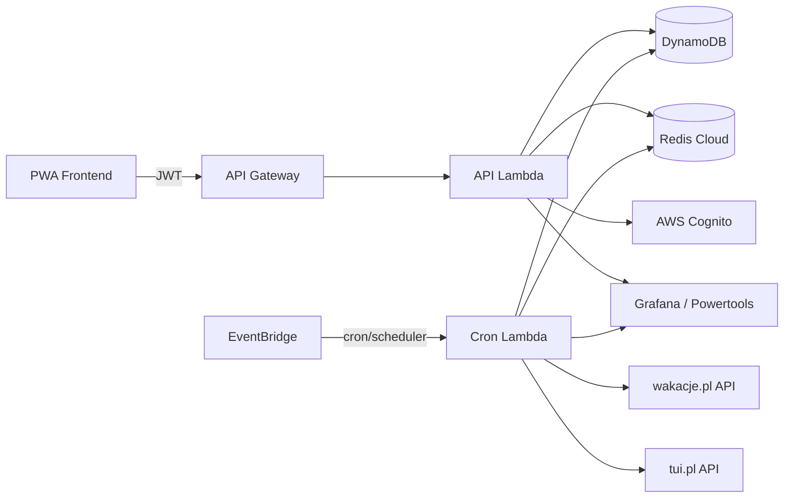

# System Overview

## Runtime model: dual lambdalith functions

The backend is packaged as **one lambdalith artifact** and deployed as **two AWS Lambda functions** with the same handler:

- `*-lambdalith-api` handles API Gateway and Cognito trigger traffic with a short HTTP timeout.
- `*-lambdalith-cron` handles EventBridge cron jobs and EventBridge Scheduler matching jobs with a 15-minute timeout.

FastAPI is exposed via [Mangum](https://mangum.io/). Scheduled job code lives under `src/app/jobs/` and shares the deployment artifact with the HTTP API, but it is invoked through the long-timeout cron function.

The codebase is split into two top-level packages under `src/`: `core/` (domain layer) and `app/` (entrypoints). See [code-structure.md](code-structure.md) for the full layering.

### Dual entry handler

```python
def handler(event: dict, context) -> dict:
    is_http = "requestContext" in event or "httpMethod" in event or "rawPath" in event

    if is_http:
        return mangum_handler(event, context)

    return asyncio.run(handle_non_http(event, context))
```

### Event Payload Routing

The scheduled job router (`handle_non_http(event, context)`) dispatches tasks based on the following input payloads:

| Event Source                  | Payload / Structure                              | Handler Path                                                           | Description                                       |
| :---------------------------- | :----------------------------------------------- | :--------------------------------------------------------------------- | :------------------------------------------------ |
| **API Gateway**               | HTTP request                                     | API Lambda → Mangum → FastAPI routers (async)                          | All `/api/v2/*` HTTP traffic                      |
| **EventBridge Cron (Scrape)** | `{ "type": "scrape_offers" }`                    | Cron Lambda → `handle_non_http` → `app.jobs.coordinator`               | Orchestrates cell scraping (3× daily)             |
| **EventBridge Cron (Avail)**  | `{ "type": "check_availability" }`               | Cron Lambda → `handle_non_http` → `app.jobs.availability`              | Checks active offer availability (1× daily)       |
| **EventBridge Scheduler**     | `{ "type": "match_user", "user_id": "usr_123" }` | Cron Lambda → `handle_non_http` → `matching_service.match_user_offers` | Debounced per-user re-match (one-time schedule)   |
| **Cognito Post-Confirm**      | Cognito `PostConfirmation` event payload         | API Lambda → `handle_non_http` → `get_or_create_user`                  | Creates `Users` row + default cells + first match |

## Application modules

`src/app/` holds **entrypoints only** — controllers and job orchestrators. Aligned with `src/app/main.py`:

| Module   | Prefix           | Responsibility                          |
| -------- | ---------------- | --------------------------------------- |
| `auth`   | `/api/v2/auth`   | Delete account (Cognito + data cascade) |
| `health` | `/api/v2/health` | System health check and telemetry       |
| `user`   | `/api/v2/user`   | Preferences, push notification settings |
| `offers` | `/api/v2/offers` | Read-only paginated offer feed          |
| `jobs`   | _(no HTTP)_      | Orchestrate scrape, match, availability |

### `core/` package

The domain layer, shared between API and jobs. Holds all business logic and infra adapters behind ports:

- Pydantic domain models (preferences, offers, market cells)
- Provider port + adapters (wakacje.pl, tui.pl)
- Repository ports + DynamoDB/Redis adapters
- Services: ingest (normalize + dedup + fingerprint), scoring, matching, activation
- Composition root (`container.py`)

`core` never imports `app`. See [code-structure.md](code-structure.md).

## External systems



## Authentication flow

| Operation      | Where                        | Notes                                                     |
| -------------- | ---------------------------- | --------------------------------------------------------- |
| Sign up        | PWA → Cognito                | Hosted UI or Amplify Auth                                 |
| Sign in        | PWA → Cognito                | Returns JWT                                               |
| API calls      | PWA → Backend                | `Authorization: Bearer <JWT>`                             |
| Delete account | PWA → `/api/v2/auth/account` | Backend deletes Cognito user + DynamoDB data + Redis keys |

Protected routes: `/api/v2/user/*`, `/api/v2/offers/*`.

## Concurrency model for jobs

The stack is **asynchronous end-to-end**: FastAPI route handlers are `async def`, repositories use `aioboto3` (async DynamoDB), provider clients use `httpx.AsyncClient`, and the feed cache uses `redis.asyncio`. Mangum drives the FastAPI app on the event loop.

The scrape work is I/O-bound (HTTP + DynamoDB), so within a single cron invocation the coordinator scrapes active market cells **concurrently** on the event loop with bounded concurrency (using an `asyncio` worker pool of ~10 workers). This avoids the 15-minute Lambda timeout as cell count grows, without spawning child Lambdas.

Async rules:

- The concurrency primitive lives in `app/jobs/coordinator` (orchestration), not `core`. `core` exposes `async` single-cell functions with no shared mutable state.
- CPU-bound scoring (numpy) is offloaded with `asyncio.to_thread(...)` so it never blocks the event loop.
- `aioboto3` clients are async context managers. They are created once per function cold start via an `AsyncExitStack` held in each function's container and reused across warm invocations — never re-created per request or per task.

If cell count eventually exceeds single-invocation limits, the cron function can fan out to per-cell worker Lambdas (replace the in-process `asyncio` fan-out with Lambda async invoke per cell) without changing `core` domain logic.

## Observability

- Structured JSON logs via AWS Lambda Powertools
- Grafana for backend metrics and log aggregation
- Sentry on the frontend PWA
